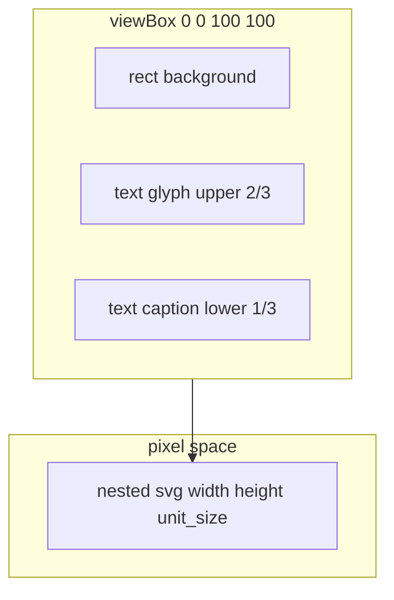

# Generic SVG unit counter

## Goal

A **reusable unit graphic**: square frame, **CSS-tinted base**, **upper ~2/3** = one line of text (glyph placeholder), **lower ~1/3** = second line (e.g. strength/stack). Internal layout in fixed **logical** SVG units; **scaled** to scenario unit size (same pattern as nested-SVG sizing in [`DisplayManager._create_unit_display`](src/hexengine/client/display_manager.py) and the factory in [`counters.py`](src/hexengine/scenarios/counters.py)).

## Layout (internal coordinates)

Use **`viewBox="0 0 100 100"`** (100×100 user units).

| Region | Bounds (example) | Content |
|--------|------------------|--------|
| Frame | Full rect `(0,0)`–`(100,100)` | Square background; **fill** from CSS (variable or class). |
| Upper band | `y ∈ [0, 66.7)` (~2/3 height) | Single **`<text>`** centered horizontally, vertically centered in band (`dominant-baseline="middle"`, `text-anchor="middle"`, x = 50). |
| Lower band | `y ∈ [66.7, 100]` (~1/3 height) | Second **`<text>`** centered in band. |

Example anchor ys: upper ~33, lower ~83 (tune after visual check).

Optional: stroke on rect; optional `clipPath` if icons become paths later.

## Scaling to hex size

- **`unit_size`** = `int(layout.size * UNIT_SIZE_DIVISOR)` (match existing [`GraphicsCreator.UNIT_SIZE_DIVISOR`](src/hexengine/units/graphics.py) / other creators).
- Nested **`<svg viewBox="0 0 100 100" width={unit_size} height={unit_size} x={-half} y={-half}>`** (or equivalent `<g>` + transform) so one implementation tracks **`hex_size`** without editing inner coordinates.

## CSS-driven base color

- Background rect class e.g. **`unit-counter-base`** with `fill: var(--unit-counter-fill, #4a5568);`
- Faction can override via existing `.unit.red` / `.unit.blue` parent rules or scenario-injected CSS.
- Mirror **hover / hilited** behavior via `.unit-counter-base` and related rules in [`resources/default/unit_counter.css`](resources/default/unit_counter.css) (loaded by [`counters.py`](src/hexengine/scenarios/counters.py)).

**Rounded corners:** The frame `<rect>` can use **`rx` / `ry` in CSS** (SVG presentation properties), e.g. `.unit-counter-base { rx: 12; ry: 12; }` alongside `fill`. Values are in the same **user units** as the inner `viewBox` (0–100), so pick a radius that looks right at that scale; they scale with the nested svg. Alternative: set `rx`/`ry` as attributes from Python if you prefer not to style them in `_CSS`.

## Creator API

Parameterize the creator with at least:

- **`glyph_text`** — upper glyph/string (e.g. `"♟"`, `"A"`).
- **`caption_text`** — lower line (e.g. `"3"`, `""`).

**Pattern note:** [`DisplayManager`](src/hexengine/client/display_manager.py) does `creator_class()` with no args. Choose one:

- **Factory** `make_counter_creator(glyph, caption) -> type` returning a small `GraphicsCreator` subclass, or
- **Adapter class** whose `__init__` stores params if the display manager is extended to accept instances.

## DisplayUnit follow-up

Today [`DisplayUnit`](src/hexengine/units/graphics.py) has a single **`text_element`**. Plan to hold **two** refs (`glyph_element`, `caption_element`) and add **`set_glyph` / `set_caption`** (or generalize `set_text`) so gameplay can update labels without DOM queries.

## Integration (phased)

1. **v1:** Python-only — register type via [`_get_graphics_creators`](src/hexengine/client/display_manager.py) or a dedicated unit class `GRAPHICS_CREATOR`.
2. **v2 (optional):** extend [`UnitGraphicsTemplate`](src/hexengine/scenarios/schema.py) / TOML and [`svg_templates.py`](src/hexengine/client/svg_templates.py) (`creator_for_template` / counter branch) for `glyph`, `caption`, fill — not blocking v1. [`scenario_unit_graphics.py`](src/hexengine/client/scenario_unit_graphics.py) re-exports the same helpers for compatibility.

## Files to touch

| Area | File(s) |
|------|---------|
| New creator + CSS | [`src/hexengine/scenarios/counters.py`](src/hexengine/scenarios/counters.py) (+ [`resources/default/unit_counter.css`](resources/default/unit_counter.css)) |
| DisplayUnit | [`src/hexengine/units/graphics.py`](src/hexengine/units/graphics.py) |
| Graphics registry | [`src/hexengine/client/display_manager.py`](src/hexengine/client/display_manager.py) |

## Verification

- Browser: unit centered on hex; resize **`hex_size`** in scenario and confirm scale.
- Both texts update via new setters if unit state drives labels later.

