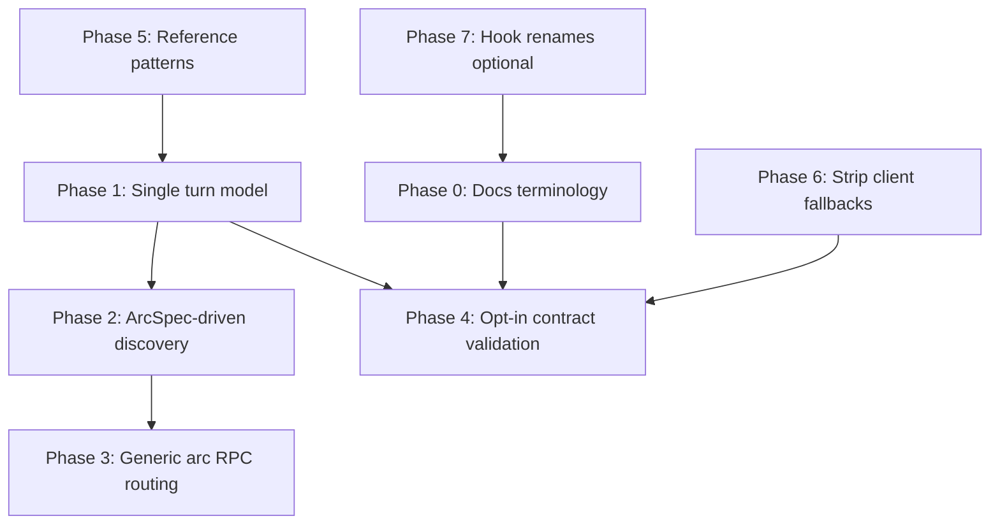

# Engine / title charter — implementation plan

**Status:** draft — phase 0 done; phases 1–7 pending.

**One-line goal:** Align runtime and contracts with the charter so titles own flow, policy, and presentation; the engine owns authority, arc cursors, and generic affordances — without hexdemo-shaped silent defaults or parallel turn models.

**Related:**

| Doc | Role |
|-----|------|
| [`ENGINE_TITLE_CHARTER.md`](ENGINE_TITLE_CHARTER.md) | Normative target (A–F) |
| [`TITLE_AUTHORING.md`](TITLE_AUTHORING.md) | Author how-to (update in phase 0) |
| [`COMBAT_ARC_GRAPH_PLAN.md`](COMBAT_ARC_GRAPH_PLAN.md) | Pack-visible interaction graph (phases 1–2 done) |
| [`engine_game_boundary_matrix.md`](engine_game_boundary_matrix.md) | Per-dimension inventory (update as phases land) |

**Already shipped (baseline for this plan):**

- Hexdemo hooks use `@bind_title_hook` scan pattern; arc wiring in [`games/hexdemo/arcs/wiring.py`](../games/hexdemo/arcs/wiring.py).
- Interaction aftermath FSM is pack-visible in [`games/hexdemo/combat/graph.py`](../games/hexdemo/combat/graph.py).
- `TurnArcRegistry` hook exists alongside legacy `StaticScheduleGameDefinition` in hexdemo.

---

## Charter decisions (execution targets)

| Id | Decision | Primary phases |
|----|----------|----------------|
| **A** | **Modification** (`MoveUnit`) is core; **interaction** is optional | 0, 5, 7 |
| **B** | Omitted interaction is valid; fail only on incomplete opt-in bundles | 4 |
| **C** | Patterns outside engine runtime; titles borrow explicitly | 5 |
| **D** | **`TurnArcRegistry` + arc cursor** control turn flow | 1 |
| **E** | **`ArcSpec` in charge** — capabilities from segments and action types | 2, 3 |
| **F** | **Free-form** presentation keys; title ensures arc ↔ registry consistency | 6 |

---

## Current pain (vs charter)

| Area | Today | Charter strain |
|------|--------|------------------|
| Turn flow | Hexdemo wraps `StaticScheduleGameDefinition` **and** exposes `TurnArcRegistry` | Two sources of truth; `turn.current_phase` still schedule-shaped |
| Interaction discovery | `authority_attack.py` requires segment id `attack` (`SEG_ATTACK`) | Titles should name segments freely; engine scans `Event("Attack")` on registered arc |
| RPC routing | Dedicated `GameServer` branches for `CombatAdvance`, `CombatDisruptInsteadOfRetreat`, `CombatDeclineAdvance` | Active segment `allowed_actions` + `submit_event` should gate |
| Contract validation | `_phase_implies_attack_schedule` infers attack hooks from phase **names** in static schedule | Opt-in bundle validation only; no combat from `"Combat"` string |
| Default movement arc | `authoring_bridge.build_default_movement_arc_spec` when title omits movement arc | Silent title-shaped fallback; patterns belong in reference packs |
| Client presentation | Engine CSS fallbacks (`hexdemo-turn-dock--*`) and default coaching copy | Wire `presentation_id` + title `shell_ui` only |

---

## Dependency overview

**Recommended PR order:** 0 (parallel) → 1 → 2 → 3 → 4 → 5 → 6 → 7 (optional, last).

Phase 5 can start after phase 1 for movement-default removal; full pattern relocation may follow phase 3.

---

## Phase 0 — Authoring vocabulary (1 PR, docs only) ✅

**Objective (A, F):** Authors read **modification** vs **interaction** in the hub doc; combat graph plan phase 3 closes.

**Deliverables:**

- [x] [`TITLE_AUTHORING.md`](TITLE_AUTHORING.md): new § “Modification vs interaction” — maps to hook families, wire verbs, pack file layout (see charter table).
- [x] Update reading order to match [`ENGINE_TITLE_CHARTER.md` § Author reading order](ENGINE_TITLE_CHARTER.md#author-reading-order-flow-centric).
- [x] [`COMBAT_ARC_GRAPH_PLAN.md`](COMBAT_ARC_GRAPH_PLAN.md) phase 3: combat graph section + template pointer.
- [x] [`PACK_HOOK_CONTRACTS.md`](PACK_HOOK_CONTRACTS.md): paths for `arcs/wiring.py`, `combat/graph.py`, segment registry.

**Exit criteria:** A new author can answer “what is optional?” and “where is flow declared?” from docs only.

**Non-goals:** Rename `MovementHook` / `AttackHook` types (phase 7).

---

## Phase 1 — Single turn model (D) (1–2 PRs)

**Objective:** Hexdemo authoritative flow comes from **`TurnArcRegistry` only**; static schedule becomes a **pattern that emits the registry**, not a parallel `GameDefinition` geometry.

**Deliverables:**

- [ ] Refactor [`games/hexdemo/game_config.py`](../games/hexdemo/game_config.py): stop wrapping `StaticScheduleGameDefinition` for turn geometry; `HexdemoGameDefinition` implements `GameDefinition` directly (movement budget, factions, lifecycle).
- [ ] Move or alias `hexdemo_four_phase_entries` into [`games/hexdemo/arcs/turn_schedule.py`](../games/hexdemo/arcs/turn_schedule.py) as the single schedule artifact; document that it **feeds** `build_hexdemo_turn_arc_registry`.
- [ ] Engine: routine phase advance uses registry cursor from hooks; audit callers of `game_definition.turn_order()` on extension-key titles — prefer registry slot metadata or arc segment projection.
- [ ] Deprecate (doc + comment) hexdemo reliance on `turn.current_phase` for **legality**; keep for display banners until phase 4/6 if needed.
- [ ] Tests: move-only template title runs without static schedule class; hexdemo full rota unchanged in behavior.

**Touch (expected):**

- `games/hexdemo/game_config.py`, `games/hexdemo/arcs/turn_schedule.py`
- `src/hexengine/server/arcs/authority_arc_runtime.py` (if schedule reads remain)
- `tests/test_gamedef.py`, arc registry tests

**Exit criteria:** Removing `StaticScheduleGameDefinition` from hexdemo does not change pytest behavior; one file answers “when does each faction act?”

**Risks:**

| Risk | Mitigation |
|------|------------|
| Hidden callers of `turn_order()` | Grep + adapter on `HexdemoGameDefinition` that derives display order from registry during transition |
| Template pack still uses static class | Template follows hexdemo in same PR or immediate follow-up |

---

## Phase 2 — ArcSpec-driven interaction discovery (E) (1 PR)

**Objective:** Engine discovers interaction commit from **registered arc topology**, not `SEG_ATTACK` / arc id `"combat"`.

**Deliverables:**

- [ ] Add `arc_supports_action_type(arc: Arc, action_type: str) -> bool` (or segment scan helper) in `hexengine.arcs` — finds segments whose transitions accept `Event(action_type)`.
- [ ] Replace `_combat_arc_supports_attack_event` in [`authority_attack.py`](../src/hexengine/server/arcs/authority_attack.py): scan interaction arc for `Attack`, not `spec.arc.get(SEG_ATTACK)`.
- [ ] Replace hardcoded cursor jumps to `SEG_ATTACK` with **entry segment for Attack path** from spec metadata or first segment that accepts `Attack` (document algorithm in module docstring).
- [ ] Hexdemo: rename segment id `attack` only if desired for dogfooding free-form ids — optional; parity tests must update.
- [ ] Remove `SEG_ATTACK` import from authority modules; keep constants in `authoring.patterns.combat` for reference graph only.

**Exit criteria:**

- Title with segment id `strike` accepting `Attack` passes authority tests.
- `test_combat_arc_declaration` and runner tests green.

---

## Phase 3 — Generic arc RPC routing (E) (1–2 PRs)

**Objective:** Reduce dedicated `GameServer` branches for interaction-aftermath RPCs; route through **`submit_event`** when the active segment allows the action type.

**Deliverables:**

- [ ] Introduce `try_arc_rpc(host, player, action_type) -> DispatchOutcome` — unified path for any action type listed on active overlay segment (replaces per-type `try_combat_arc_rpc` sprawl).
- [ ] Migrate `CombatAdvance`, `CombatDeclineAdvance`, `CombatDisruptInsteadOfRetreat` handlers in [`game_server.py`](../src/hexengine/server/game_server.py) to generic path.
- [ ] Migrate combat-scoped `MoveUnit` (`try_combat_arc_move_unit`) to segment-gated modification path where possible.
- [ ] Reject unknown RPCs with segment-deny message (charter B), not “title misconfigured.”
- [ ] Document stable **wire verb** list in [`PACK_HOOK_CONTRACTS.md`](PACK_HOOK_CONTRACTS.md); note verbs are core mechanisms, segment allowance is title policy.

**Exit criteria:**

- [`tests/test_combat_arc_dispatch.py`](../tests/test_combat_arc_dispatch.py) green via generic router.
- No new title-specific `if request.action_type ==` blocks without justification comment.

**Non-goals:** Rename wire verbs (`CombatAdvance` → title-specific names) — verbs stay stable; titles gate via segments.

---

## Phase 4 — Opt-in contract validation (B) (1 PR)

**Objective:** Startup validation checks **declared** bundles only; remove phase-name attack heuristics.

**Deliverables:**

- [ ] Remove or gate `_phase_implies_attack_schedule` / `_schedule_expects_attack_hooks` in [`contracts.py`](../src/hexengine/hooks/internal/contracts.py).
- [ ] New rules:
  - Interaction arc registered → require full attack hook bundle + `combat_rules_binding` + presentation registry entries for declared `ui_mode`s.
  - No interaction arc → attack hooks optional; move-only schedule valid.
- [ ] Validate `TurnArcRegistry` completeness when hook returns registry (existing `validate.py` paths).
- [ ] Add test: four-phase **move-only** title (no overlay arc) starts clean; incomplete interaction bundle fails fast.

**Exit criteria:** Charter table in § Opt-in bundles matches test cases.

**Depends on:** Phase 1 (registry authoritative), phase 0 (docs).

---

## Phase 5 — Reference patterns, not runtime (C) (2 PRs)

**Objective:** Pattern modules are **borrow-only**; engine does not silently build hexdemo-shaped graphs.

**PR 5a — Stop silent movement default**

- [ ] Remove or narrow [`build_default_movement_arc_spec`](../src/hexengine/hooks/internal/authoring_bridge.py) usage in [`game_server.py`](../src/hexengine/server/game_server.py): movement arc comes from title `ArcHook` or explicit opt-in preset.
- [ ] Template + hexdemo declare movement arc explicitly (or bind `ENGINE_DEFAULT` preset documented in template).
- [ ] Tests for titles without movement arc: modification still works via core path or clear startup error if arc required.

**PR 5b — Pattern package boundary**

- [ ] Audit `GameServer` and `server/arcs/*` imports from `authoring.patterns.*`; move title-facing builders toward `games/reference/` or document “copy from hexdemo.”
- [ ] `StaticScheduleGameDefinition` remains as **pattern helper** that returns `TurnArcRegistry` + display metadata, not authority class for extension-key titles.
- [ ] [`games/template/`](../games/template/): minimal registry + optional stub interaction graph.

**Exit criteria:** `rg 'from hexengine.authoring.patterns' src/hexengine/server` shows no title-semantics imports in authority hot path.

---

## Phase 6 — Presentation boundary (F) (1 PR)

**Objective:** Engine affordances only; no hexdemo-named CSS or coaching fallbacks.

**Deliverables:**

- [ ] Remove or genericize `hexdemo-turn-dock` CSS prefix logic in [`client_interaction_panels.py`](../src/hexengine/game/arcs/client_interaction_panels.py); classes come from title segment presentation DTOs.
- [ ] Audit engine UI hooks for hardcoded hexdemo copy; replace with neutral placeholders or omit when wire omits `presentation_id`.
- [ ] Hexdemo [`ui/segment_registry.py`](../games/hexdemo/ui/segment_registry.py) owns all segment skin keys referenced by arcs.
- [ ] Contract test: every `ui_mode` in registered arcs appears in presentation registry (when session key set).

**Exit criteria:** New template title renders without hexdemo CSS classes in engine code paths.

---

## Phase 7 — Optional hook renames (A) (defer)

**Objective:** Align type names with modification / interaction vocabulary.

**Deliverables (only if churn acceptable):**

- [ ] Alias or rename `MovementHook` → modification hook family name.
- [ ] Alias or rename `AttackHook` → interaction hook family name.
- [ ] Deprecation period with re-exports.

**Defer** until phases 1–6 stable; docs (phase 0) already use charter terms.

---

## Phase 4 (COMBAT_ARC_GRAPH_PLAN) — Tooling (optional)

From [`COMBAT_ARC_GRAPH_PLAN.md`](COMBAT_ARC_GRAPH_PLAN.md) phase 4 — not blocking charter:

- [ ] `describe_arc(arc) -> str` for debug/CI.
- [ ] Pytest/CLI helper to print hexdemo interaction graph.

Schedule after phase 2 if graph introspection aids ArcSpec migration reviews.

---

## Testing strategy

| Layer | Tests |
|-------|--------|
| Turn model | Registry-only hexdemo; template move-only; `NextPhase` cursor walks registry |
| ArcSpec discovery | Custom segment ids accepting `Attack`; no `SEG_ATTACK` in authority |
| RPC routing | Generic router dispatches aftermath verbs; illegal RPC rejected at segment |
| Contracts | Incomplete interaction bundle fails; omitted interaction passes |
| Patterns | No default movement arc without hook; template explicit wiring |
| Presentation | Registry completeness; no engine hexdemo CSS in snapshot tests |
| Regression | Full pytest suite; combat arc runner tests; authority attack pipeline |

Add **charter fixture titles** under `tests/fixtures/titles/` when helpful:

- `move_only` — registry only, no overlay arc.
- `minimal_interaction` — custom arc/segment ids, single gate segment.

---

## Documentation updates (rolling)

Update as each phase lands:

- [`ENGINE_TITLE_CHARTER.md`](ENGINE_TITLE_CHARTER.md) migration backlog — strike items, link PRs.
- [`engine_game_boundary_matrix.md`](engine_game_boundary_matrix.md) — ownership rows for turn model, RPC routing, patterns.
- Pack READMEs: [`games/hexdemo/arcs/README.md`](../games/hexdemo/arcs/README.md), [`games/hexdemo/README.md`](../games/hexdemo/README.md).

---

## Suggested first PRs

1. **Phase 0** — docs only, zero runtime risk.
2. **Phase 1** — hexdemo single turn model (highest structural clarity for authors).
3. **Phase 2 + 3** — can combine if generic router and Attack discovery share helpers.

Estimated touch for phases 1–3: ~8 engine files, ~6 pack files, ~4 test modules, 0 wire protocol break if verb names unchanged.

---

## Success criteria

A maintainer can verify charter compliance when:

1. Hexdemo flow is read from `arcs/turn_schedule.py` + `combat/graph.py` without opening `StaticScheduleGameDefinition`.
2. A move-only title starts with no attack hooks and no contract error.
3. Authority modules do not import pattern segment id constants.
4. `GameServer` routes overlay RPCs through segment allowance, not a growing action-type elif chain.
5. Engine client code does not mention hexdemo presentation prefixes.

---

## Open decisions

1. **Wire verb stability:** Keep `CombatAdvance` et al. as core interaction-aftermath verbs, or namespace under title payload only?
2. **Display `turn.current_phase`:** Remove from wire vs keep as derived banner field from registry slot?
3. **Reference pack location:** `games/reference/` vs keep hexdemo as sole reference until a second title exists.
4. **Phase 1 scope:** Retire `StaticScheduleGameDefinition` globally for extension-key titles only, or deprecate class entirely?

Record decisions in charter **Migration backlog** notes as they close.
